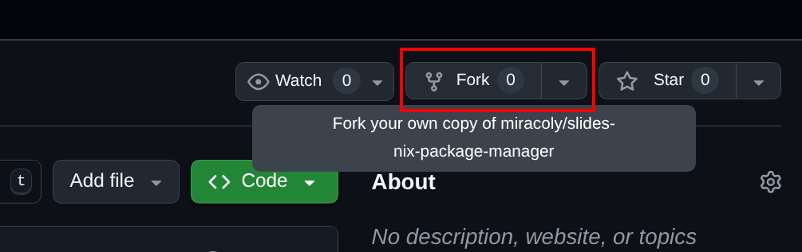
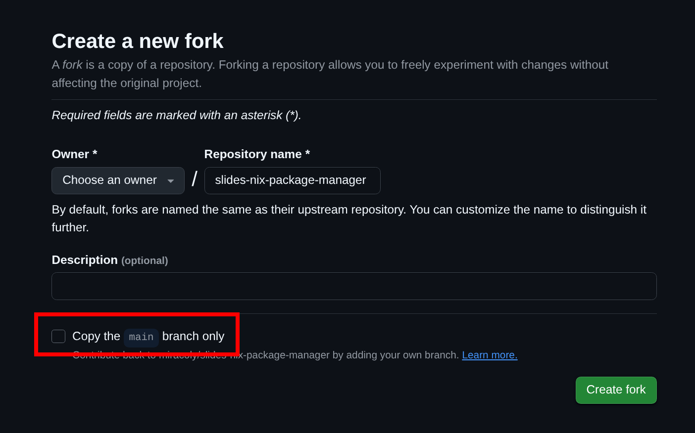
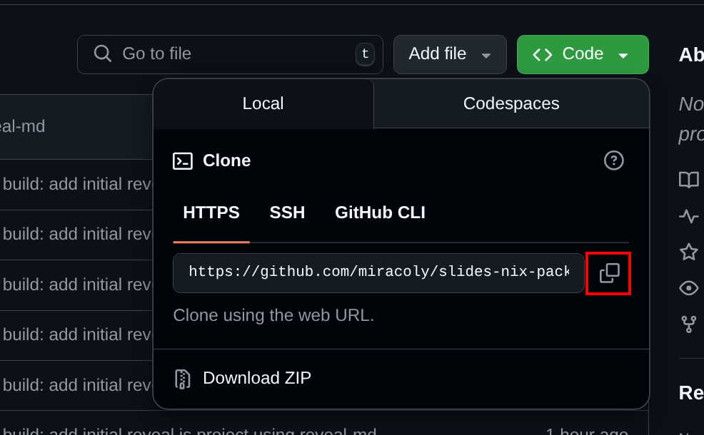
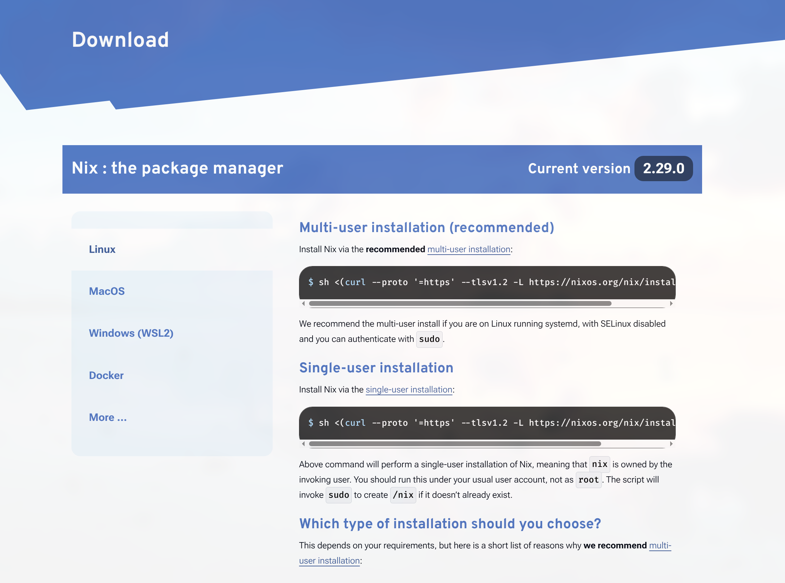
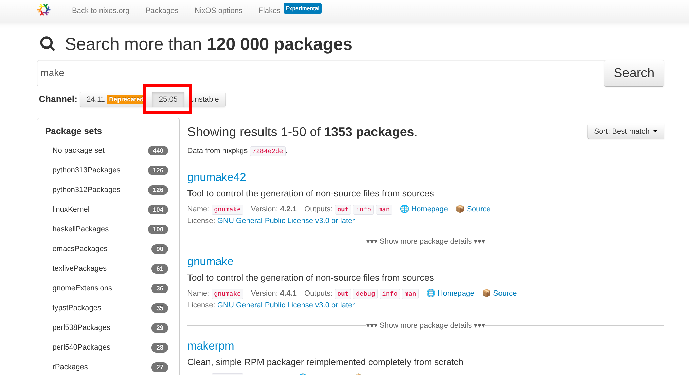
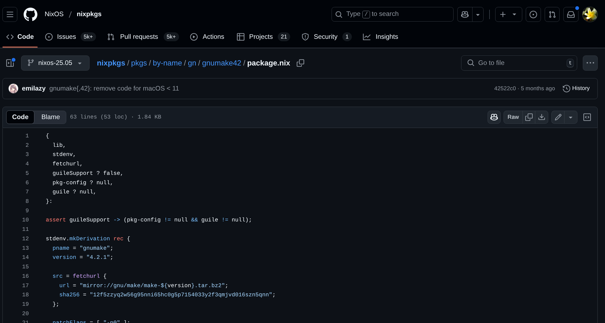
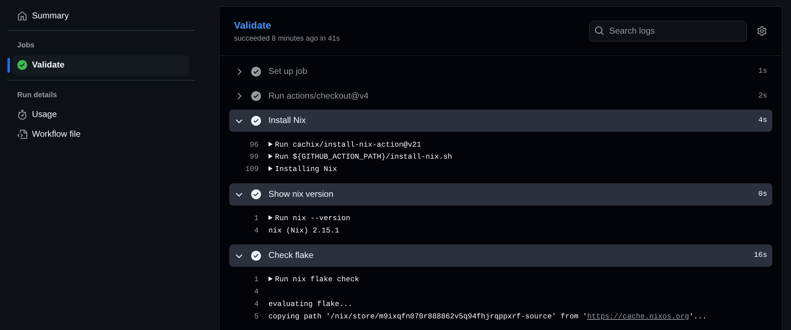
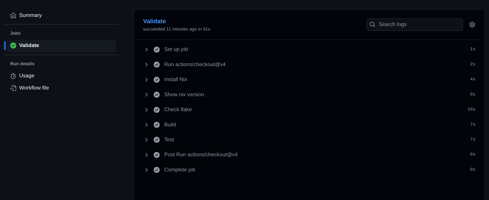

# Hier gibts nix zu sehen

 <!-- .element: class="img-small" -->
> Laptop needed by everyone

---

The Problem

## Dependencies <!-- .element: class="fragment" -->

- libraries <!-- .element: class="fragment" -->
- tools to build software <!-- .element: class="fragment" -->
- tooling for local development <!-- .element: class="fragment" -->

---

### UDP Gütersloh

- k8s, helm, fluxcd, minikube, k9s <!-- .element: class="fragment" -->
- bruno, gradle, kotlin, jq, openssl, sops <!-- .element: class="fragment" -->
- telepresence in specific version <!-- .element: class="fragment" -->
- playwright with browsers <!-- .element: class="fragment" -->
- many env vars for e2e tests <!-- .element: class="fragment" -->

---

### Control Center

- terraform, yarn, socat, lens <!-- .element: class="fragment" -->
- azurecli in specific version <!-- .element: class="fragment" -->
- gauge, taiko <!-- .element: class="fragment" -->
- cypress with browsers <!-- .element: class="fragment" -->

---

### Apprentice Program

- asciidoctor-pdf <!-- .element: class="fragment" -->
- gitlint, pnpm <!-- .element: class="fragment" -->
- ruby <!-- .element: class="fragment" -->

---

### Academy Day Presentation

- if you want to present a non-trivial project, you spend a lot of time <!-- .element: class="fragment" -->
  - C/C++, Haskell, Go, Python
  - installing dependencies <!-- .element: class="fragment" -->
  - configuring your machine <!-- .element: class="fragment" -->

---

### Situation

- if you want to run a project, you need to install all dependencies <!-- .element: class="fragment" -->
  - every developer <!-- .element: class="fragment" -->
  - for every machines <!-- .element: class="fragment" -->
  - including CI, which can be pain <!-- .element: class="fragment" -->

---

- if dependencies are added or updated
  - you can repeat this process <!-- .element: class="fragment" -->
  - you might break the pipeline <!-- .element: class="fragment" -->
  - it might now work on all machines <!-- .element: class="fragment" -->

---

- adding dependencies differ between system and dependency
  - `apt`, `pacman`, `yum`, `brew`
  - `pip`, `npm`, `yarn`, `gem`, `cargo`, `mvn`
  - bash-scripts

---

Solution

 <!-- .element: class="img-small fragment" -->

---

## Nix

- declarative: one file to rule them all <!-- .element: class="fragment" -->
  - libs, tools, versions <!-- .element: class="fragment" -->
- language agnostic: <!-- .element: class="fragment" -->
  - C-libs, Python, Go, Haskell, Node-modules <!-- .element: class="fragment" -->
- multiple versions of the same program? <!-- .element: class="fragment" -->
  - no problem, nix handles it <!-- .element: class="fragment" -->
- reproducible <!-- .element: class="fragment" -->

---

## Fork Repo

---

<https://github.com/miracoly/slides-nix-package-manager>



---



---

```sh
git clone https://github.com/<YOUR_USERNAME>/slides-nix-package-manager
```

 <!-- .element: class="img-small" -->

---

## Installation

---

### Install Nix

- go to nix' download page:
  - Linux: <https://nixos.org/download/#nix-install-linux>
  - Windows (WSL2): <https://nixos.org/download/#nix-install-windows>
- chose Multi-User installation

---



---

- execute script

```sh
sh <(curl --proto '=https' --tlsv1.2 -L https://nixos.org/nix/...
```

- confirm with `y` when asked
- enter password if `sudo`

---

### Enable Flakes

*/etc/nix/nix.conf*

```env [15-17]
experimental-features = nix-command flakes
```

---

### Sanity Check 1

```nix [6-11]
{
  outputs = { /* ... */ }:
    flake-utils.lib.eachDefaultSystem (system: let
      pkgs = import nixpkgs {inherit system;};
    in {
      apps.default = {
        type = "app";
        program = toString (pkgs.writeShellScript "nix-check" ''
          echo "✅ Nix flakes are working on ${system}!"
        '');
      };
      devShells.default = pkgs.mkShell {
        packages = [pkgs.hello];
        shellHook = ''
          echo "🛠️  Welcome to the Nix dev shell (${system})"
          echo "Try running: hello"
        '';
      };
    });
}
```

---

- navigate to `examples/sanity-check`
- run `nix run`

```sh
$ nix run
✅ Nix flakes are working on x86_64-linux!
```

---

### Sanity Check 2

```nix [12-18]
{
  outputs = { /* ... */ }:
    flake-utils.lib.eachDefaultSystem (system: let
      pkgs = import nixpkgs {inherit system;};
    in {
      apps.default = {
        type = "app";
        program = toString (pkgs.writeShellScript "nix-check" ''
          echo "✅ Nix flakes are working on ${system}!"
        '');
      };
      devShells.default = pkgs.mkShell {
        packages = [pkgs.hello];
        shellHook = ''
          echo "🛠️  Welcome to the Nix dev shell (${system})"
          echo "Try running: hello"
        '';
      };
    });
}
```

---

- run `hello`
  - expected behavior: `command not found: 'hello'`
- run `nix develop` to enter the dev shell
- if you're using `zsh`, run `nix develop -c zsh`
- run `hello` again

```sh
$ hello
Hello, world!
```

---

- press `Ctrl-D` to exit dev shell
- run `hello` again
- as before `command not found: 'hello'`

---

### What we've achieved

- nix installed
- build every project with nix
- one custom dev shell for every project

---

### Ease of development

- Problem: you need to manually run `nix develop` to enter dev shell
- Solution: `direnv` and `nix-direnv`

---

#### direnv

- shell extension
- run script on directory enter
  - e.g. load env vars

#### nix-direnv <!-- .element: class="mt-3" -->

- replacement for part of `direnv`
- allows to automatically enter nix shell

---

#### Install direnv

- [direnv for Ubuntu](https://packages.ubuntu.com/search?keywords=direnv&searchon=names&suite=all&section=all)

```
sudo apt install direnv
```

---

#### Hook direnv into your shell

*$HOME/.bashrc*

```rc
eval "$(direnv hook bash)"
```

*$HOME/.zshrc*

```rc
eval "$(direnv hook zsh)"
```

---

#### Silent direnv output

*$HOME/.config/direnv/direnv.toml*

```toml
[global]
log_filter = "^$"
log_format = "-"
```

---

#### Install nix-direnv

```sh
nix profile install nixpkgs#nix-direnv
```

#### Add nix-direnv to direnvrc <!-- .element: class="mt-3" -->

*$HOME/.config/direnv/direnvrc*

```rc
source $HOME/.nix-profile/share/nix-direnv/direnvrc
```

---

#### Use direnv

- close and reopen your terminal
- run the following command:

```bash
cd example/sanity-check
# tell direnv to use flakes
echo "use flake" >> .envrc
# allow to automatically enter dev shell for this dir
direnv allow
```

---

#### Test direnv

- now you should automatically enter the dev shell
- validate with:

```sh
# navigate to your home dir
cd ~
# navigate to previous dir (examples/sanity-check)
cd -
```

---

## Nix by Example

---

Let's skip the *"boring"* nix language part and dive right into a real world example

---

### KBOOM

```sh
$ ./kboom
kboom — big-integer maths demo (GNU MP powered)

Usage:
  ./kboom factorial | fa   <n>
  ./kboom fibonacci | fi   <n>
  ./kboom sumsquare | s    <n>
  ./kboom -h | --help

<n> must be a non-negative integer (GMP handles arbitrarily large values).
```

---

### Preview

---

### Build it locally

```sh  
cd examples/kboom
# from now on, we'll do everything in this dir
make
```

---

- do you have `make` available?
- what about lib `gmp` for big ints?
- do you even have `gcc`?

---

### Create a dev shell

---

#### Define Inputs

*examples/kboom/flake.nix*

```nix
{
  inputs = {
    nixpkgs.url = "github:NixOS/nixpkgs/nixos-25.05";
  };
}
```

---

Define outputs

```nix [7-11]
{
  inputs = {
    nixpkgs.url = "github:NixOS/nixpkgs/nixos-25.05";
  };

  outputs = {
    nixpkgs,
    flake-utils,
    ...
  }: {};
}
```

---

Support each default system

```nix [4, 12-14]
{
  inputs = {
    nixpkgs.url = "github:NixOS/nixpkgs/nixos-25.05";
    flake-utils.url = "github:numtide/flake-utils";
  };

  outputs = {
    nixpkgs,
    flake-utils,
    ...
  }:
    flake-utils.lib.eachDefaultSystem (system: let
      pkgs = import nixpkgs {inherit system;};
    in {});
}
```

---

Define default dev shell

```nix [10-17]
{
  outputs = {
    nixpkgs,
    flake-utils,
    ...
  }:
    flake-utils.lib.eachDefaultSystem (system: let
      pkgs = import nixpkgs {inherit system;};
    in {
      devShells.default = pkgs.mkShell {
        nativeBuildInputs = with pkgs; [
          gcc
          gdb
          gmp
          gnumake
        ];
      };
    });
}
```

---

### Try building again

```sh
# enter dev shell
nix develop -c zsh
# build kboom
make

# run the app
./main.out

# automatically enter dev shell
direnv allow
```

---

### Where do these packages come from?

---

- <https://search.nixos.org/packages>



---

- <https://github.com/NixOS/nixpkgs>



---

### Build with nix

---

Let's create a package

```sh [12 -14]
{
  outputs = {
    nixpkgs,
    flake-utils,
    ...
  }:
    flake-utils.lib.eachDefaultSystem (system: let
      pkgs = import nixpkgs {inherit system;};
    in {
      devShells.default = pkgs.mkShell {};

      packages = with pkgs; {
        kboom = stdenv.mkDerivation {};
      };
    });
}
```

---

Define metadata

```sh [7-9]
{
  outputs = {}: {
      devShells.default = pkgs.mkShell {};

      packages = with pkgs; {
        kboom = stdenv.mkDerivation {
          pname = "kboom";
          version = "0.1.0";
          src = ./.;
        };
      };
    });
}
```

---

Define build dependencies

```sh [11-12]
{
  outputs = {}: {
      devShells.default = pkgs.mkShell {};

      packages = with pkgs; {
        kboom = stdenv.mkDerivation {
          pname = "kboom";
          version = "0.1.0";
          src = ./.;

          buildInputs = [gmp];
          nativeBuildInputs = [gcc gnumake];
        };
      };
    });
}
```

---

Define build steps

```sh [9-15]
{
  outputs = {}: {
      packages = with pkgs; {
        kboom = stdenv.mkDerivation {
          # ...
          buildInputs = [gmp];
          nativeBuildInputs = [gcc gnumake];

          buildPhase = ''
            make
          '';
          installPhase = ''
            mkdir -p $out/bin
            cp main.out $out/bin/kboom
          '';
        };
      };
    });
}
```

---

#### Let's build it

```txt
# inside examples/kboom
nix build .\#kboom
```

```sh
# inside examples/kboom

# out build output
ls -la result/bin/kboom
```

---

Make kboom our default app

```nix [6-9]
{
  outputs = {}:
    flake-utils.lib.eachDefaultSystem (system: let
      pkgs = import nixpkgs {inherit system;};
    in {
      packages = with pkgs; rec {
        default = kboom;
        kboom = stdenv.mkDerivation {};
      };
    });
}
```

---

Build again and run

```sh
# inside examples/kboom
nix build

# run the app, either
result/bin/kboom
# or
nix run
```

---

### E2E tests

- `examples/kboom/kboom.spec.rb`
- executes the app and expects correct `stdout`
- dependencies: `rspec`

---

#### dev shell

```nix [12]
{
  outputs = { }:
    flake-utils.lib.eachDefaultSystem (system: let
      pkgs = import nixpkgs {inherit system;};
    in {
      devShells.default = pkgs.mkShell {
        nativeBuildInputs = with pkgs; [
          gcc
          gdb
          gmp
          gnumake
          rubyPackages.rspec
        ];
      };
    });
}
```

---

#### run tests from shell

```sh
# inside examples/kboom

# main.out is expected
make
# run tests
rspec ./*.rb

```

---

- great for local development, but requires `main.out` to be present
- what about a self-contained way of running e2e tests?

---

#### Shell Application

```nix [7-9]
{
  outputs = {}: {
      packages = with pkgs; rec {
        default = kboom;
        kboom = stdenv.mkDerivation {};

        test = pkgs.writeShellApplication {
          name = "kboom-tests";
        };
      };
    });
}
```

---

Dependencies

```nix [7-14]
{
  outputs = {}: {
      packages = with pkgs; rec {
        test = pkgs.writeShellApplication {
          name = "kboom-tests";

          runtimeInputs = with pkgs; let
            rubyWithRSpec = pkgs.ruby.withPackages (ps: [ps.rspec]);
          in [
            gcc
            gnumake
            gmp
            rubyWithRSpec
          ];
        };
      };
    });
}
```

---

Actual script

```nix [7-14]
{
  outputs = {}: {
      packages = with pkgs; rec {
        test = pkgs.writeShellApplication {
          name = "kboom-tests";
          runtimeInputs = [...];
          text = ''
            set -euo pipefail
            echo "🧪 Executing RSpec …"
            BIN=${kboom}/bin/kboom rspec --format documentation ./*.rb
          '';
        };
      };
    });
}
```

---

#### Infinite Possibilities

- linting
  - `gitlint`
  - `markdownlint`,`clang-tidy`
  - `hadolint` for Dockerfiles
- formatting
  - `prettier`
  - `dockerfmt`
  - `ormolu`
- testing
  - `playwright`
  - `gtest`

---

### Pipeline

- everyone can do everything locally, great!
- but can we do more?
- what about building, linting and testing in the pipeline?

---

#### Let's create a simple validation pipeline

---

Github Actions Workflow

```yaml
name: Validation

on:
  push:

jobs:
  validate:
    name: Validate
    runs-on: ubuntu-latest
```

---

Checkout and install nix with caching

```yaml [11-17]
name: Validation

on:
  push:

jobs:
  validate:
    name: Validate
    runs-on: ubuntu-latest

    steps:
      - uses: actions/checkout@v4

      - name: Install Nix
        uses: cachix/install-nix-action@v21
        with:
          github_access_token: ${{ secrets.GITHUB_TOKEN }}
```

---

Show version and check flake

```yaml [10-14]
jobs:
  validate:
    steps:
      - uses: actions/checkout@v4
      - name: Install Nix
        uses: cachix/install-nix-action@v21
        with:
          github_access_token: ${{ secrets.GITHUB_TOKEN }}

      - name: Show nix version
        run: nix --version

      - name: Check flake
        run: nix flake check
```

---

Commit and Push



---

```yaml [9-15]
jobs:
  validate:
    steps:
      - name: Show nix version
        run: nix --version
      - name: Check flake
        run: nix flake check

      - name: Build
        working-directory: examples/kboom
        run: nix build .#kboom

      - name: Test
        working-directory: examples/kboom
        run: nix run .#test
```

---

Commit and Push



---

### Some additional hints

---

#### Adhoc shell

- sometimes you temporally need a program, but you don't want to install it

```sh
$ nix shell nixpkgs\#hello-go -c zsh
$ hello-go
Hello, world!
```

---

#### Clean up

- nix stores all derivations under `/nix/store/`
- one derivation for each version of each program
- in time, this takes up space

```sh
sudo nix-collect-garbage --delete-older-than 90d
```

---

## Where to go from here?

---

- this was just the tip of the iceberg
- much was omitted:
  - classic nix vs flakes controversial
  - nix language specifics
- the nix rabbit hole is deep, very deep
- the documentation is ...not so great

---

### Learn more

- [nix.dev](https://nix.dev/)
- [NixOS & Flakes Book](https://nixos-and-flakes.thiscute.world/)
- [Videos by Vimjoyer 🎥](https://www.youtube.com/watch?v=9OMDnZWXjn4)
- ask [our lord and savior 🤖](https://chatgpt.com/)

---

### Takeaways for our company

- start by providing simple dev shells
- this is especially helpful for part-time projects
  - e.g. apprentice guide, kb app, wheel of fun
- write simple shell apps for linting and formatting
  - use in CI Pipeline

---

## Thank you

---

## Questions?
